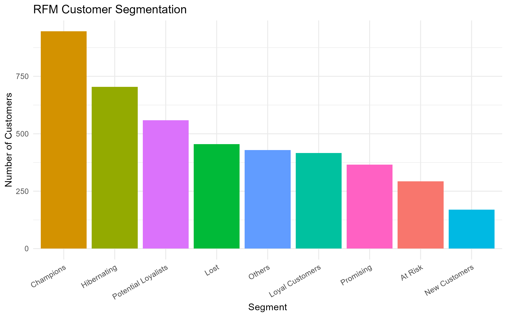
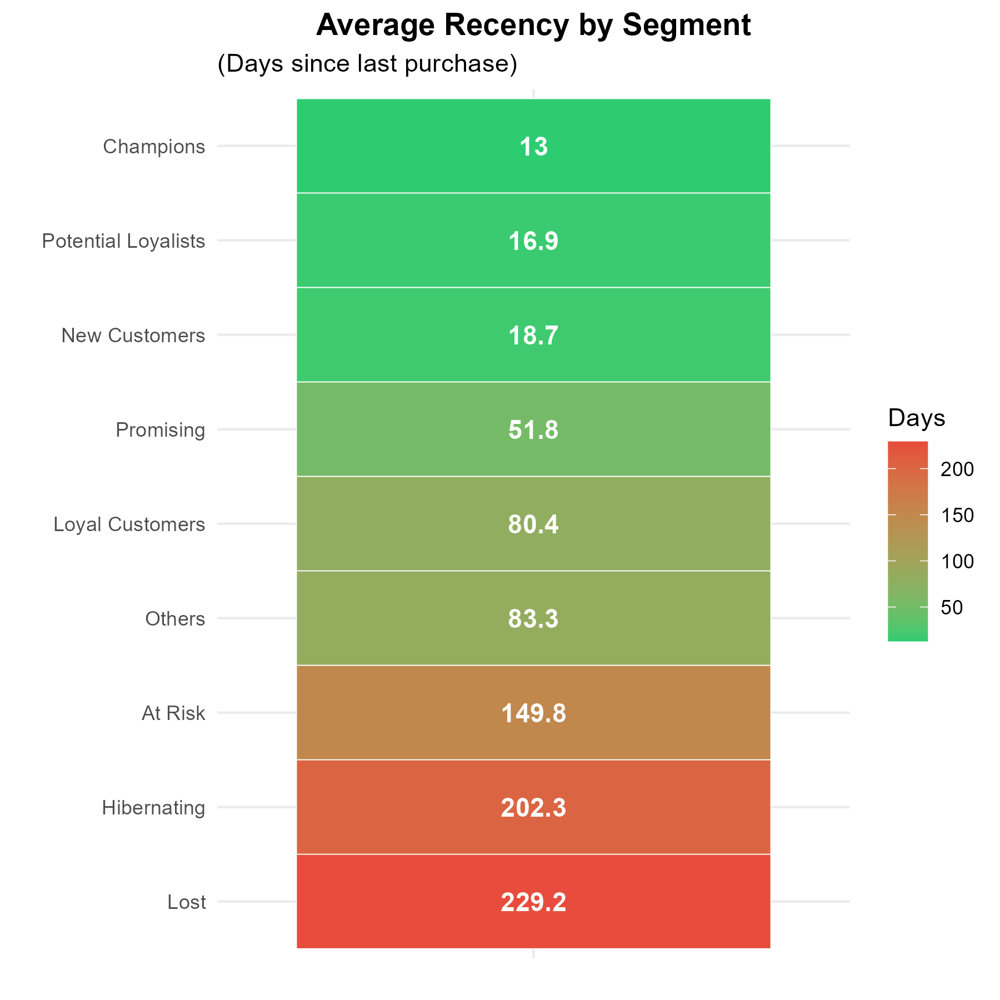
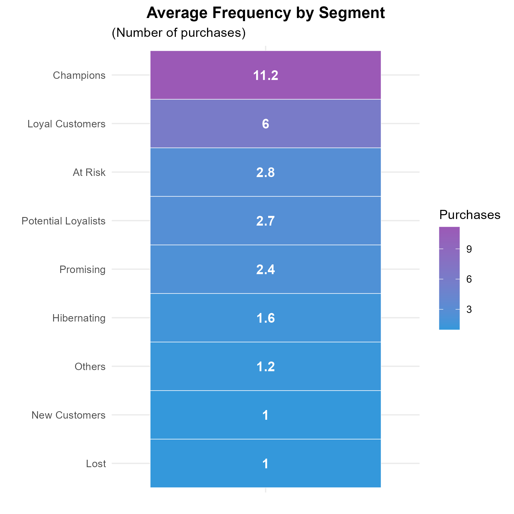
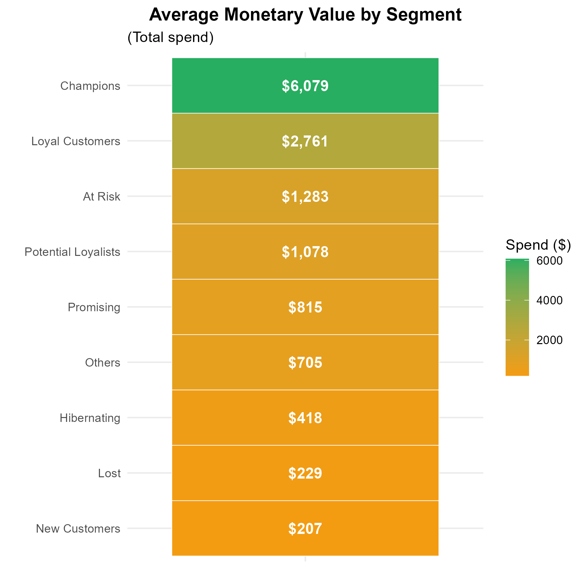
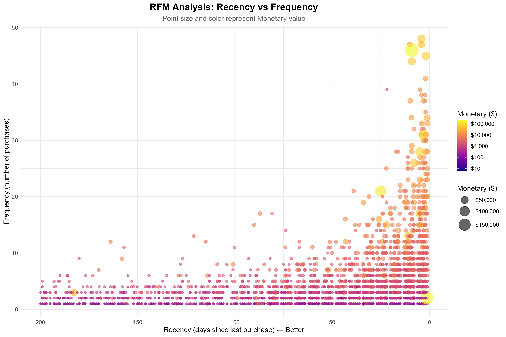

# RFM-сегментация клиентов интернет-магазина

## Краткое описание проекта

Провёл **RFM-анализ (Recency, Frequency, Monetary, или давность, частота, денежность)** на 541 909 транзакциях британского онлайн-магазина подарков, чтобы выделить наиболее ценных клиентов и оптимизировать маркетинговые расходы.

---

## Бизнес-задача

**Цель:** сегментировать клиентскую базу, чтобы приоритизировать маркетинговые усилия и повысить окупаемость инвестиций (ROI).

**Проблема:** ограниченный маркетинговый бюджет (~$500K в год) распределяется равномерно на 4 372 клиентов, что неэффективно.

**Решение:** использовать RFM-сегментацию, чтобы:
- сфокусировать усилия на наиболее прибыльных сегментах;
- запустить win-back и retention‑кампании для клиентов с риском ухода.

---

## Датасет

- **Источник:** [UCI Online Retail Dataset](https://archive.ics.uci.edu/dataset/352/online+retail)
- **Период:** декабрь 2010 — декабрь 2011
- **Объём:** 541 909 транзакций | 4 372 клиента | 4 070 товаров
- **География:** интернет-магазин подарков, ориентированный на покупателей из Великобритании

---

## Методы

1. **Очистка данных**
   - Удалил ~135K транзакций без `CustomerID`.
   - Отфильтровал возвраты (отрицательный `Quantity`).
   - Добавил переменную `TotalPrice = Quantity × UnitPrice` для расчёта выручки.

2. **Расчёт RFM‑метрик**
   - **Recency (R):** количество дней с момента последней покупки (дата среза — 10.12.2011).
   - **Frequency (F):** число уникальных заказов на клиента.
   - **Monetary (M):** суммарные затраты клиента за весь период наблюдения.

3. **Скоринг**
   - Присвоил каждому клиенту квантильные R/F/M‑скоры от 1 до 5 (1 — низкое значение, 5 — высокое).

4. **Сегментация**
   - На основе комбинаций R/F/M выделил 10 бизнес‑сегментов (Champions, Loyal Customers, At Risk, Lost и др.).

5. **Визуализация**
   - Построил тепловые карты (heatmaps), scatter‑диаграммы и распределения по сегментам.

---

## Основные результаты

### 1. Сегмент Champions даёт ~33% выручки при ~10% клиентов

- **Профиль:** клиенты с недавними покупками (в среднем 11 дней назад), высокой частотой заказов (≈11) и большим LTV (≈$6 079).
- **Вклад:** ~$2,7 млн, или около 33% общей выручки.
- **Рекомендация:** запустить программу лояльности для VIP‑клиентов (персональные предложения, ранний доступ к новинкам, бесплатная доставка).

### 2. Сегмент At Risk: под угрозой ~$795K выручки

- **Профиль:** клиенты, которые тратили много (в среднем ~$1 283), но не покупают уже 150+ дней.
- **Возможность:** win‑back кампания (серия писем, промокод −20%, персональные рекомендации).
- **Ожидаемый эффект:** реактивация 30–40% сегмента → дополнительно ~$240–320K.

### 3. Сегмент Lost: нецелесообразно активно таргетировать

- **Профиль:** клиенты с единичной покупкой в прошлом, не активны 230+ дней, низкий общий чек (≈$229).
- **Рекомендация:** исключить из регулярных кампаний и не тратить на них бюджет, использовать только пассивные/массовые каналы.

---

## Визуализации

### RFM‑метрики по сегментам

  
*Champions и Potential Loyalists показывают минимальную давность покупок (самые «тёплые» клиенты).*

  
*Champions и Loyal Customers покупают в 5–11 раз чаще среднестатистического клиента.*

  
*Champions тратят в среднем в 6 раз больше, чем типичный клиент.*

### Scatter‑диаграмма

  
*Левый верхний угол (низкий Recency, высокая Frequency) — Champions; правый нижний — Lost (редкие и давно не покупающие клиенты).*

---

## Маркетинговые рекомендации

| Сегмент              | % клиентов | % выручки | Стратегия                            | Потенциал ROI       |
|----------------------|-----------:|----------:|--------------------------------------|----------------------|
| Champions            |     10.3%  |    32.9%  | VIP‑программа лояльности             | ≈ +$400K             |
| Loyal Customers      |     19.4%  |    28.2%  | Upsell / кросс‑продажи премиум‑товаров | ≈ +$230K           |
| At Risk              |     14.2%  |     9.6%  | Win‑back (скидка 20%, персональные офферы) | ≈ +$280K     |
| Potential Loyalists  |     13.3%  |     7.1%  | Стимул ко 2‑й покупке, welcome‑серия | ≈ +$150K             |
| New Customers        |      6.4%  |     2.8%  | Онбординг, обучение, скидка на повторную покупку | ≈ +$80K  |
| Lost                 |      8.0%  |     3.4%  | Исключить из таргетированных кампаний | ≈ −$50K «сэкономлено» |

**Суммарный потенциальный рост:** примерно **+ $1,1 млн выручки** (~13% роста относительно текущего уровня).

---

## Инструменты и библиотеки

- **Язык:** R (4.3+)
- **Основные пакеты:** `tidyverse`, `readxl`, `lubridate`, `ggplot2`, `scales`
- **Методы:** очистка данных, RFM‑анализ, квантильный скоринг, бизнес‑сегментация, визуализация в ggplot2.

---

## Структура репозитория

- `rfm-customer-segmentation`
   - `data`
      - `Sales_Data.xlsx` сырые данные
   - `results`
      - `segment_summary.csv` обработанные данные по сегментам
      - визуализация
   - `RFM analysis script.Rmd` код в R 
   - `RFM_analysis_script.html` html-версия файла с кодом 
   - `README.md`
   - `README_RUS.md`

---

## Как воспроизвести
### 1. Клонировать репозиторий
git clone https://github.com/Wladislawe/rfm-customer-segmentation

### 2. Установить пакеты в R
install.packages(c("tidyverse", "readxl", "lubridate", "scales", "ggplot2"))

---

## Резюме проекта
**До RFM**:

Траты на маркетинг: $500 000 равно тратятся на 4 372 клиентов

**После RFM**:

Перераспределение бюджета: 60% на Champions/Loyal (50% клиентов, 61% выручки)

Возвращение клиентов: получаем $280 000 от At Risk

Сбережения: исключение Lost → сохраняем $50 000/год

Прогнозируемый ROI: +13% выручки (+$1,1 млн)

---

## 📧 Контакты
#### Владислав Овчаренко
##### количественный BI и опросный аналитик

[Профиль в LinkedIn](https://www.linkedin.com/in/vlad-ovcharenko-9aa5013aa/?locale=en-US)
Email: vladgrinov890@gmail.com
Telegram: @vlad1s_love
